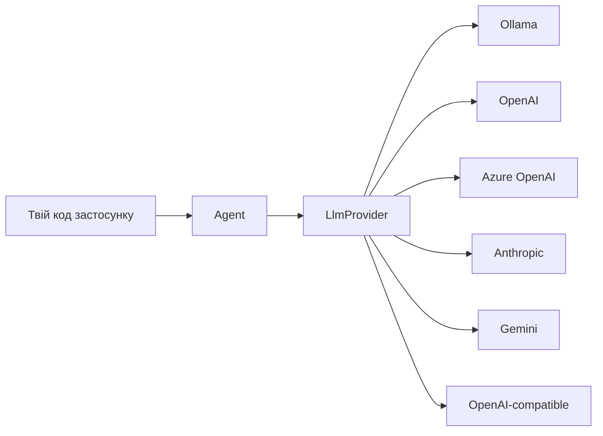
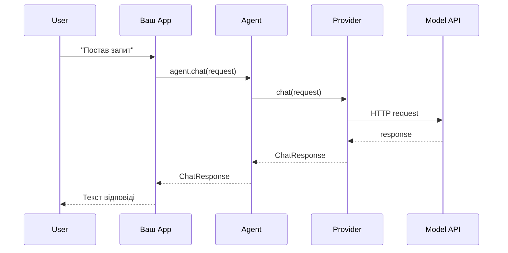
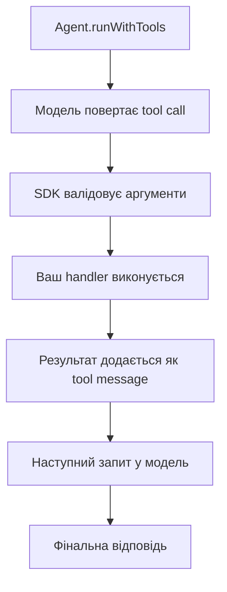

# Swallow SDK: Пояснення Для Junior

## Що Це Таке

Swallow SDK — це TypeScript/JavaScript бібліотека для роботи з LLM-провайдерами через єдиний API.

Простими словами:

- Ти пишеш один і той самий код клієнта.
- А під капотом можеш переключати провайдера: Ollama, OpenAI, Azure OpenAI, Anthropic, Gemini, OpenAI-compatible.
- SDK бере на себе запити, стрім, tool calling, MCP-інтеграції, типізацію та базову обробку помилок.

---

## Коли Це Корисно

- Коли хочеш швидко зробити AI-функцію в продукті.
- Коли треба тестувати кілька моделей/вендорів без переписування коду.
- Коли потрібні tools (функції) і агентний цикл.
- Коли треба підключати зовнішні MCP сервери.

---

## Головна Ідея Архітектури



Тобто:

1. Твій код говорить з `Agent`.
2. `Agent` говорить з конкретним `Provider`.
3. Провайдер робить реальні HTTP запити до API моделі.

---

## Базовий Потік Chat Запиту



---

## Мінімальний Приклад

```ts
import { Agent, OllamaProvider } from 'swallow';

const provider = new OllamaProvider({
  baseUrl: 'http://127.0.0.1:11434',
});

const agent = new Agent(provider);

const response = await agent.chat({
  model: 'llama3.1',
  messages: [{ role: 'user', content: 'Поясни, що таке REST API у 2 реченнях.' }],
});

console.log(response.content);
```

---

## Streaming (Коли Текст Йде Частинами)

```ts
import { Agent, OpenAiProvider } from 'swallow';

const provider = new OpenAiProvider({ apiKey: process.env.OPENAI_API_KEY });
const agent = new Agent(provider);

for await (const chunk of agent.stream({
  model: 'gpt-4o-mini',
  messages: [{ role: 'user', content: 'Напиши короткий план навчання TypeScript.' }],
})) {
  process.stdout.write(chunk.delta);
}
```

---

## Tool Calling (Коли Модель Викликає Твої Функції)

`runWithTools` дозволяє моделі викликати описані інструменти.



```ts
import { Agent, OpenAiProvider } from 'swallow';

const provider = new OpenAiProvider({ apiKey: process.env.OPENAI_API_KEY });
const agent = new Agent(provider);

const result = await agent.runWithTools(
  {
    model: 'gpt-4o-mini',
    messages: [{ role: 'user', content: 'Яка погода в Києві?' }],
    tools: [
      {
        name: 'getWeather',
        description: 'Повертає погоду по місту',
        parameters: {
          type: 'object',
          properties: {
            city: { type: 'string' },
          },
          required: ['city'],
        },
      },
    ],
    toolChoice: 'auto',
  },
  {
    getWeather: async (args) => {
      const city = (args as { city: string }).city;
      return { city, tempC: 24, condition: 'sunny' };
    },
  },
);

console.log(result.final.content);
```

---

## MCP: Зовнішні Інструменти Через Сервер

Swallow SDK вміє підключати MCP сервери і використовувати їх tools.

```ts
import { Agent, OpenAiProvider, McpServer } from 'swallow';

const provider = new OpenAiProvider({ apiKey: process.env.OPENAI_API_KEY });
const agent = new Agent(provider);

const mcp = new McpServer({
  transport: 'stdio',
  command: 'npx.cmd',
  args: ['-y', '@modelcontextprotocol/server-memory'],
});

const result = await agent.runWithMcpTools(
  {
    model: 'gpt-4o-mini',
    messages: [{ role: 'user', content: 'Збережи нотатку і прочитай її.' }],
    toolChoice: 'auto',
  },
  mcp,
);

console.log(result.final.content);
mcp.close();
```

---

## Конфіг Ресурсів: mcpServers + skills + agents + prompts

Можна завантажувати все разом з JSON:

```json
{
  "mcpServers": {
    "memory": {
      "command": "npx.cmd",
      "args": ["-y", "@modelcontextprotocol/server-memory"],
      "autoStart": true
    }
  },
  "skills": {
    "check-security": {
      "description": "Security checks",
      "file": "./skills/check-security/SKILL.md"
    }
  },
  "agents": {
    "Explore": {
      "description": "Read-only exploration"
    }
  },
  "prompts": {
    "triage": "Summarize open bugs by severity"
  }
}
```

```ts
import { createMcpRuntimeFromJsonFile } from 'swallow';

const runtime = await createMcpRuntimeFromJsonFile('./runtime.config.json');

console.log(Object.keys(runtime.mcpServers));
console.log(Object.keys(runtime.skills));
console.log(Object.keys(runtime.agents));
console.log(Object.keys(runtime.prompts));
```

---

## Що Варто Запам'ятати Junior Розробнику

1. Завжди починай з одного провайдера і простого `agent.chat(...)`.
2. Додавай `stream(...)`, коли треба кращий UX.
3. Додавай `runWithTools(...)`, коли моделі треба доступ до функцій застосунку.
4. Використовуй MCP, коли tools мають приходити із зовнішніх серверів.
5. Не хардкодь ключі в коді, використовуй env-змінні.

---

## Швидкий Старт Локально

```bash
npm install
npm run build
npm run demo
```

Після цього відкрий у браузері:

```text
http://127.0.0.1:5177
```
