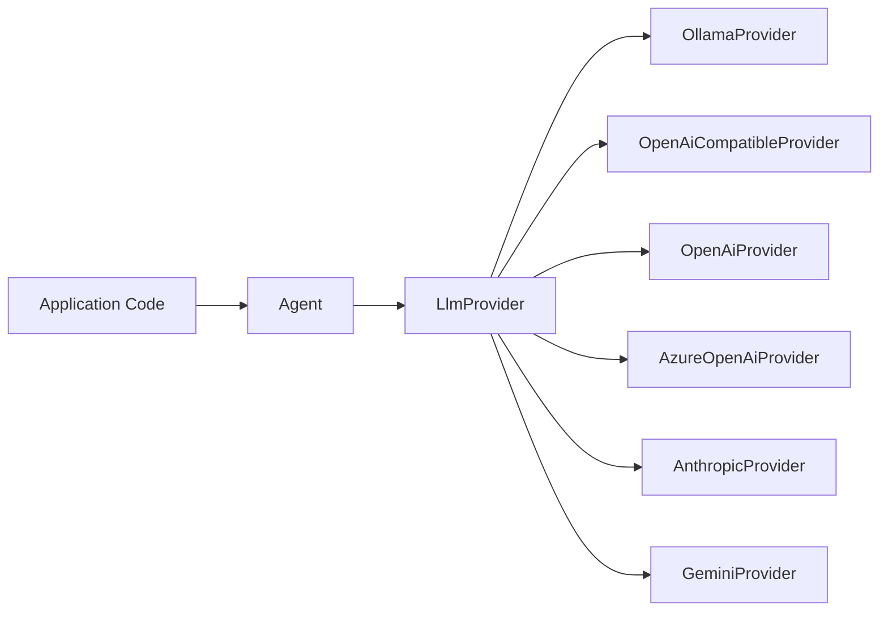
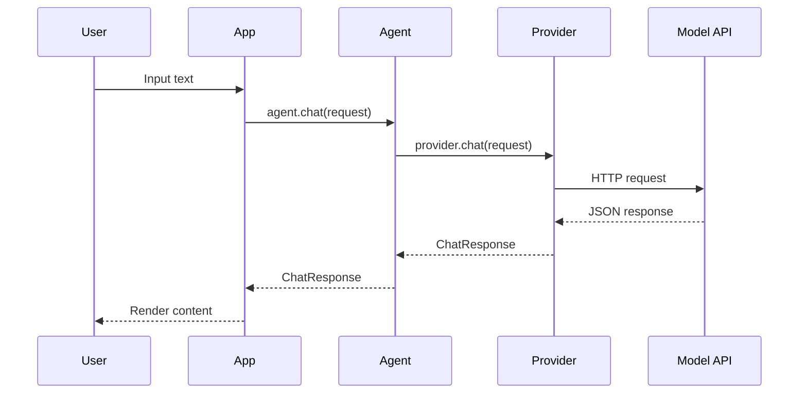
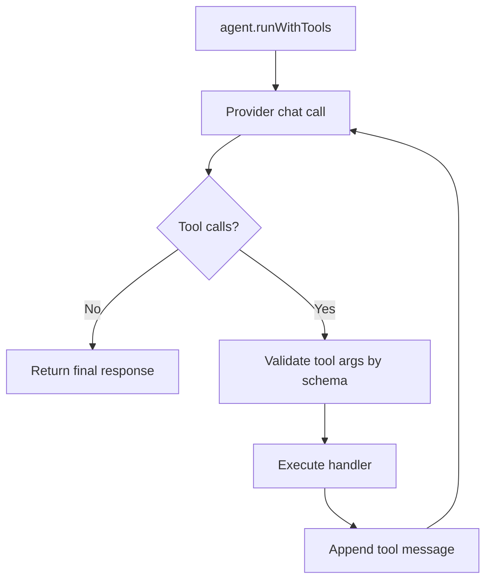

# 02. Architecture

## Високорівнева схема

## Як проходить звичайний chat

## Як проходить runWithTools

## Головні модулі в SDK

- `src/agent/client.ts`
  - Клас `Agent`
  - Делегує базові операції провайдеру
  - Реалізує цикл `runWithTools` і `runWithMcpTools`

- `src/providers/*.ts`
  - Реалізації провайдерів
  - Мапінг request/response до єдиного контракту

- `src/http/client.ts`
  - Спільний HTTP шар (retry, timeout, middleware)

- `src/agent/mcp.ts`
  - MCP транспорт (`http`, `stdio`)
  - MCP runtime config helpers

- `src/types/types.ts`
  - Базові контракти SDK

## Дизайн-принципи

- Єдиний API для різних провайдерів
- Типобезпека через TypeScript strict
- Мінімум vendor lock-in
- Розширюваність через tools і MCP
